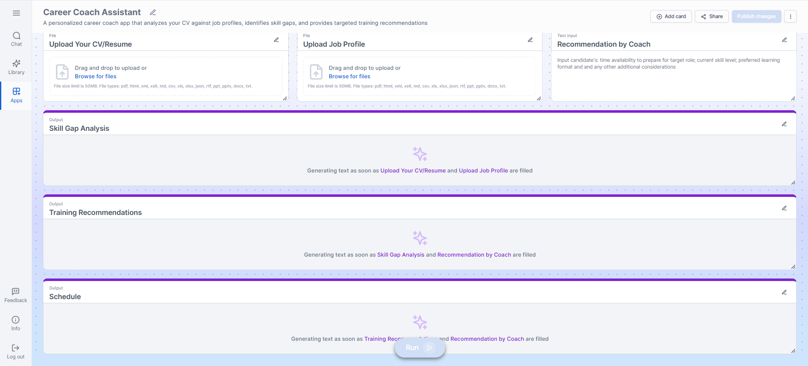
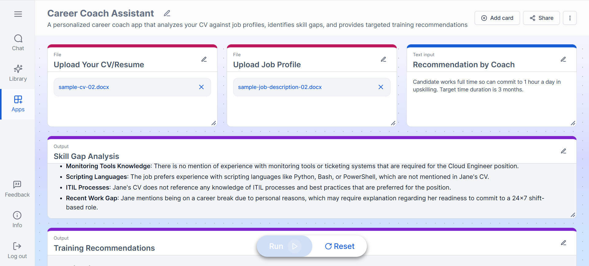
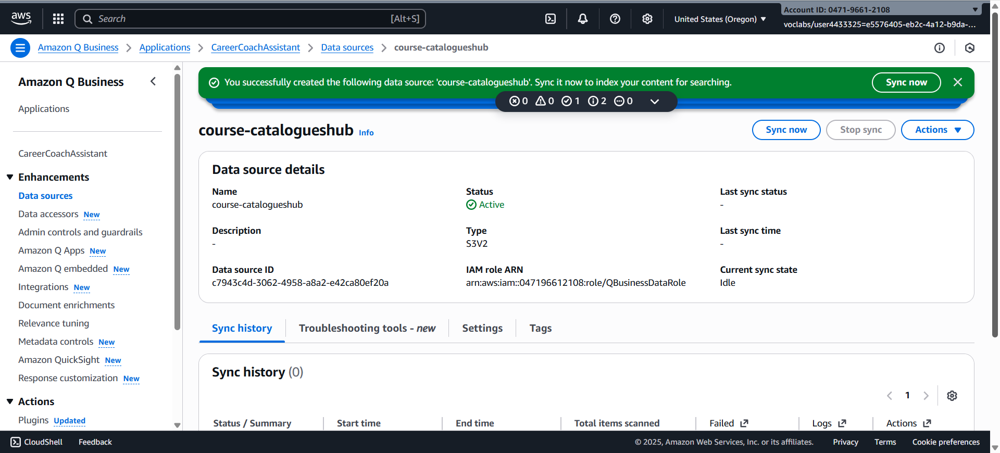
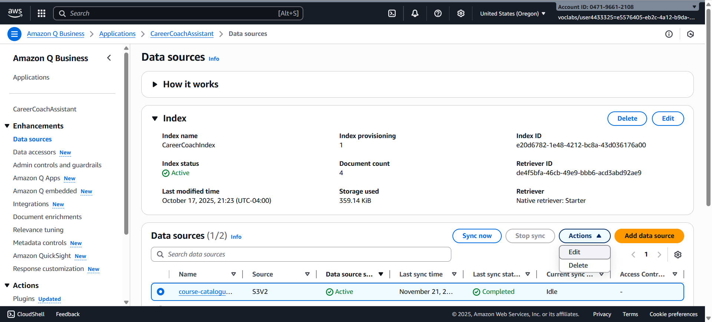
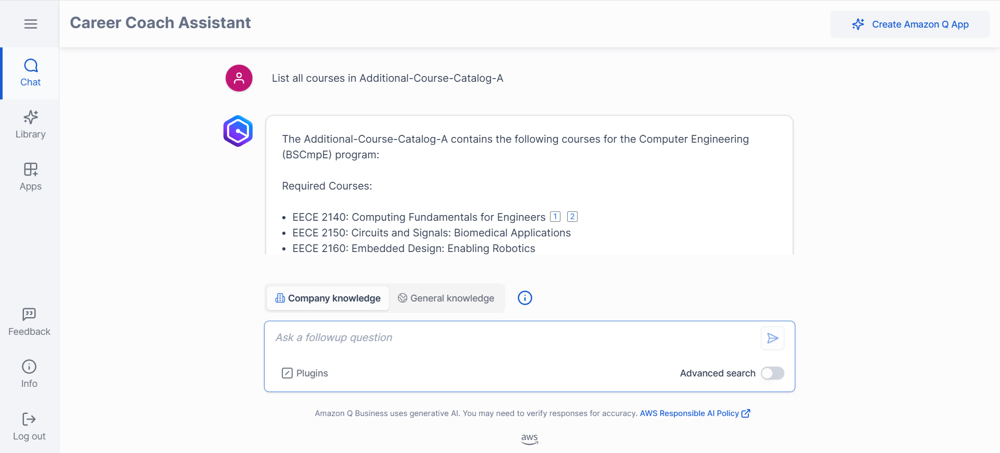
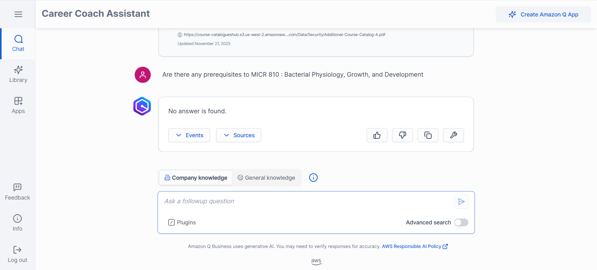
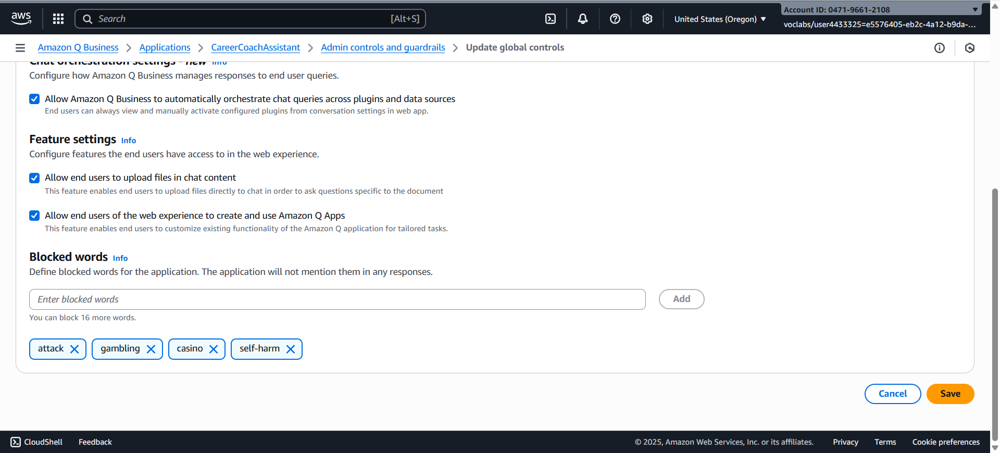
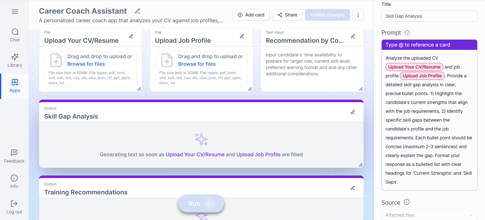

# AI-Powered Career Coach Assistance Application
### Project Submission — Career4All

---

## Table of Contents

1. [Create and Customize Amazon Q Application](#1-create-and-customize-amazon-q-application)
2. [Upload Static PDF and Connect Amazon S3](#2-upload-static-pdf-and-connect-amazon-s3)
3. [Secure the Application](#3-secure-the-application)
4. [Publish and Share the Application](#4-publish-and-share-the-application)
5. [Submission Checklist](#5-submission-checklist)

---

## 1. Create and Customize Amazon Q Application

### Build a Functioning Q App

The application was created in Amazon Q Apps with the following configuration:

**Input Cards**
- CV upload
- Job profile / job description upload
- Coach recommendation input (free text)

**Output Cards**
- Skill gap analysis
- Training recommendations
- Suggested learning schedule



### Customize the Application

The following enhancements were added and tested:

- An output card for a suggested learning schedule
- An input card for personalized recommendations by coaches
- Functionality of all added components confirmed working



---

## 2. Upload Static PDF and Connect Amazon S3

### Static PDF Course Catalog

A PDF course catalog was manually uploaded to Amazon Q Business and indexed as a data source.

> Note: sync status is not visible on this screen — this is expected behaviour confirmed by the BI Track support group. Integration was verified by querying the system and confirming retrieval of relevant course details.

### Amazon S3 Data Source

An Amazon S3 bucket (`course-catalogueshub`) was created and configured as a data source.

**S3 Bucket Structure**
```
course-catalogueshub/
└── Data/
    ├── Security/     ← Course Catalogues A and B
    └── Medicine/     ← Restricted medicine catalogs
```



### Automatic Daily Sync

A daily sync schedule is configured and active for the S3 data source.

---

## 3. Secure the Application

### Access Control — Restricted Course Content

Course access is restricted by coach expertise using an ACL configuration file applied to the S3 data source.

**IAM Identity Center Group**

| Group | Users |
|---|---|
| CareerCoaches | career.coach.one, career.coach.two |

**ACL Configuration — `config/access-control-list.json`**

```json
[
  {
    "keyPrefix": "s3://course-catalogueshub/Data/Security/",
    "aclEntries": [
      {
        "Name": "CareerCoaches",
        "Type": "GROUP",
        "Access": "ALLOW"
      }
    ]
  },
  {
    "keyPrefix": "s3://course-catalogueshub/Data/Medicine/",
    "aclEntries": [
      {
        "Name": "CareerCoaches",
        "Type": "GROUP",
        "Access": "DENY"
      }
    ]
  }
]
```

**Steps completed:**
- Used existing `CareerCoaches` group in IAM Identity Center (no new groups created)
- Created `Data/Medicine/` and `Data/Security/` folders in the S3 bucket
- Uploaded restricted course files to the appropriate folders
- Uploaded and applied `access-control-list.json` to the S3 data source
- Synced the data source after applying the ACL



**Verification**





### Content Moderation — Keyword Blocking

Keyword blocking was configured under **Admin Controls and Guardrails → Global Controls** in Amazon Q Business.

**Blocked Keywords**

| Keyword |
|---|
| Gambling |
| Casino |
| Self-harm |
| Attack |



### Skill Gap Analysis — Output Card Prompt



---

## 4. Publish and Share the Application

The application was shared with all users in the account.

**Steps completed:**
- Application shared account-wide
- Custom labels applied: `Career Coaching`, `AI-powered`
- Application endorsed and marked as a **Verified Q App**

---

## 5. Submission Checklist

| # | Requirement | Status |
|---|---|---|
| 1 | Screenshot of final application (all input and output cards) | ✅ |
| 2 | Screenshot of data sources showing last sync time | ✅ |
| 3 | Screenshot of Skill Gap Analysis output card prompt | ✅ |
| 4 | Screenshot of blocked keywords configuration | ✅ |
| 5 | ACL file (`config/access-control-list.json`) | ✅ |

---

## Related Files

- [Project Brief](project-brief.md)
- [ACL Configuration](../config/access-control-list.json)
- [README](../README.md)

